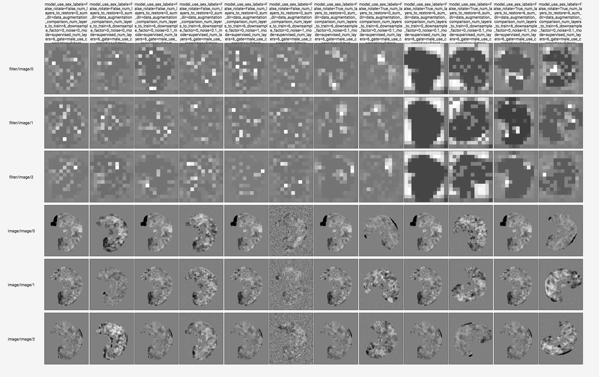

# 3D-CNN-for-Autism-Diagnosis

A 3D CNN which attempts to classify patients with ASD from controls using 3D fMRIs from the open ABIDE dataset (N=1071). 

Currently the limited data set size has made any meaningful generalization difficult to obtain but work is still in progress.

# Experiments

